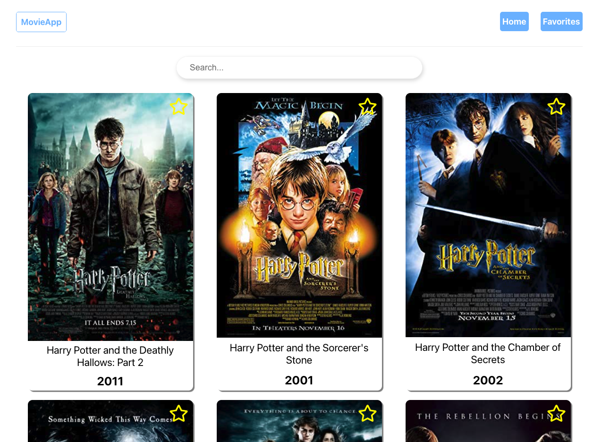

## Movie Search App

Bu ödevde OMDb API kullanarak film araması yapabilme ve filmleri favorilere ekleyebilme fonksiyonları olan bir React uygulaması geliştireceğiz.

  

  

  

### Proje Nasıl Çalıştırılır

- Projeyi fork'ladıktan ya da indirdikten sonra projenin bulunduğu klasörde "npm install" komutu ile gerekli paketlerin yüklenmesi gerekiyor.
- OMDb API kullanabilmek için bir API key'e ihtiyacımız var. Email adresinizle [buradan](http://www.omdbapi.com/apikey.aspx) alabilirsiniz. API key'i MovieContext component'i içerisinde constant olarak tanımlanmış API_KEY'e atadıktan sonra OMDb API'ı kullanmaya başlayabilirsiniz.
- Daha sonra "npm run start" komutu ile uygulama başlatılabilir.

### Proje Hakkında

Bu projede filmler ile alakalı anahtar kelimeyi arama kutucuğuna yazdıktan sonra OMDb API'ya atılan istek sayesinde film listeleme yapılıyor. Film kartlarının sağ üst köşesinde bulunan yıldız ikonu sayesinde filmleri favorilere ekleyebiliyoruz. Favoriler route'unda eklenilen bu filmleri listeleyebiliyoruz. Film kartına tıkladığımızda ise filme ait daha detaylı bilgiye ulaşabildiğimiz detay sayfası görüntüleniyor.

### Yapılacaklar

### İpuçları
